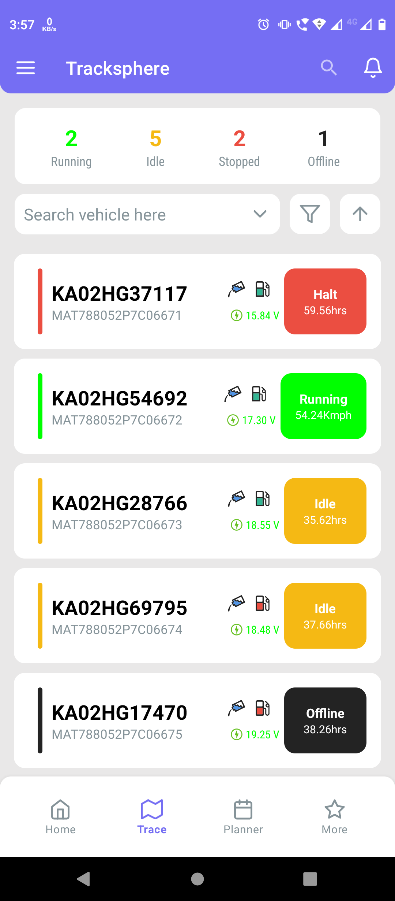
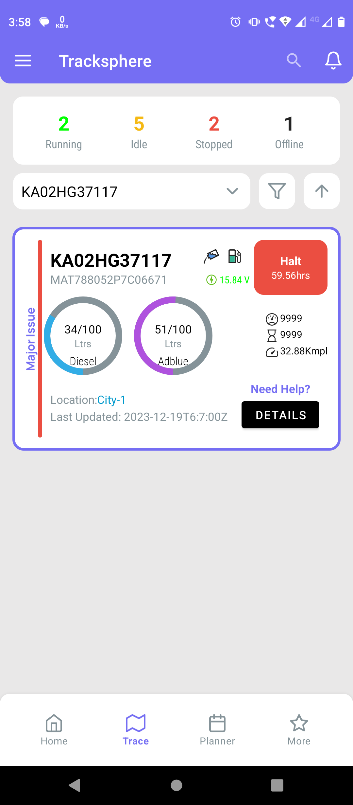
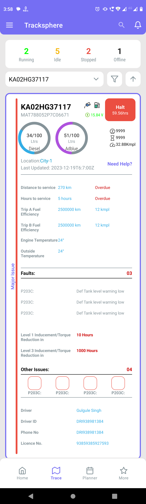
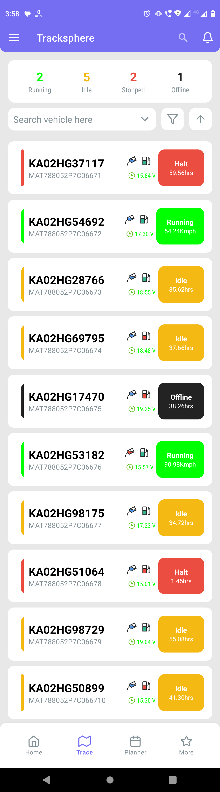

# Project Setup and Design

This document outlines the setup and design of the Android project.

## Screenshots
| Image |
|---|---|
|  |
|  |
|  |
|  |

## Project Structure

The project follows a standard Android project structure with the following key directories:

- **app:** Contains the application code, including activities, fragments, views, and resources.
- **data:** Contains data-related components, such as models, repositories, and data sources.
- **ui:** Contains UI-related components, such as activities, fragments, and views.
- **helper:** Contains utility classes and helper functions.

## Components

The project consists of the following main components:

- **Activities:** Entry points for the application, responsible for managing the overall user interface.
- **Fragments:** Modular UI components that can be combined to create complex screens.
- **ViewModels:** Responsible for managing UI-related data and logic, following the MVVM architecture pattern.
- **Repositories:** Act as intermediaries between the UI and data sources, providing data access and manipulation functionalities.
- **Data sources:** Provide access to data, such as local databases, remote APIs, or shared preferences.

## Design Decisions

The following key design decisions were made during the development of the project:

- **MVVM Architecture:** The project follows the Model-View-ViewModel (MVVM) architecture pattern to separate concerns and improve testability.
- **Data Binding:** Data binding is used to bind UI elements to data in the ViewModel, reducing boilerplate code and improving data synchronization.
- **Navigation Component:** The Navigation component is used for managing navigation between screens, providing a structured and consistent navigation flow.

## Dependencies

The project utilizes the following key dependencies:

- NA

## Build Instructions

To build the project, follow these steps:

1. Clone the repository.
2. Open the project in Android Studio.
3. Build the project using the "Build" menu.
